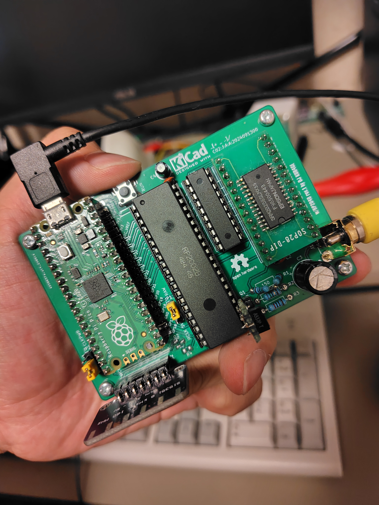

# RP2C02 & RP2040 DevBoard

## 概要
RP2C02の限界が見たかったので作った

## 写真

## 部品
- 1 x Raspberry Pi Pico
- 1 x RP2C02
- 1 x Si5351Aモジュール(Adafruitタイプ、25MHz) or ピン互換の21.477272MHzモジュール(各自で作成)
- 1 x 2SA937
- 1 x 74HC573
- 1 x 62256 (<120ns)
- 2 x 100nF 2.54mm
- 1 x 22uF 5.0φ
- 1 x 470uF
- 1 x 150ohm
- 1 x 75ohm
- 1 x 820ohm
- 1 x RCAコネクタ

## なんでRP2040？
手元にあったのと流行りなので…

## レベル変換は？
- ADCピン以外は5.0Vまで耐えられるらしいので、それを信じることにした
- WRITEだけなら問題ない(割り込みピンはOpen-Drain駆動)